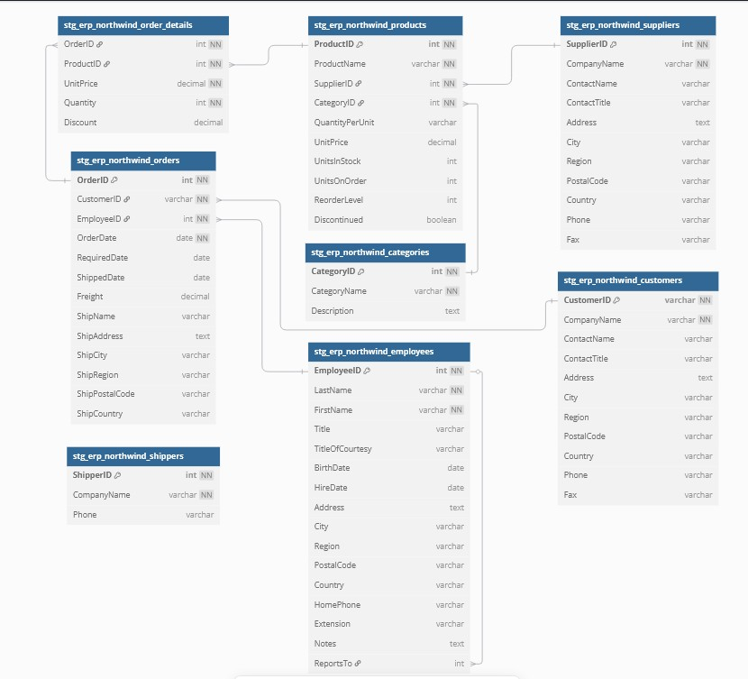
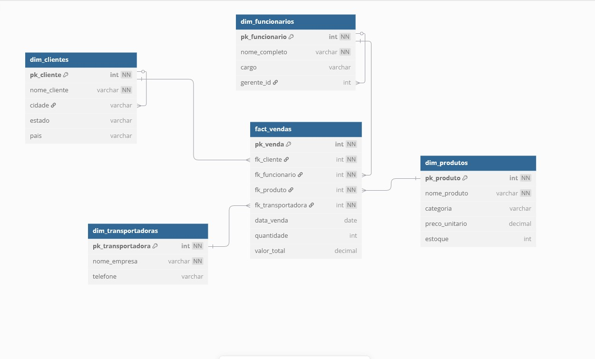

# dbt_with_ai

## Visão Geral
Este projeto demonstra como a inteligência artificial (IA) pode ser integrada e utilizada para desenvolver modelos dbt (Data Build Tool) de forma eficiente. Ao aproveitar o poder da IA, buscamos simplificar a criação, documentação e teste de modelos dbt, destacando seu potencial nos fluxos de trabalho modernos de engenharia de dados.

## Estrutura do Projeto
O projeto está organizado nos seguintes diretórios principais:

- **models/**: Contém todos os modelos dbt, organizados em subdiretórios:
  - **staging/**: Modelos que preparam os dados brutos para transformações posteriores. Contém os seguintes modelos:
    - `stg_erp_northwind_categorias.sql`: Prepara os dados das categorias de produtos.
    - `stg_erp_northwind_clientes.sql`: Prepara os dados dos clientes.
    - `stg_erp_northwind_fornecedores.sql`: Prepara os dados dos fornecedores.
    - `stg_erp_northwind_funcionarios.sql`: Prepara os dados dos funcionários.
    - `stg_erp_northwind_ordem_itens.sql`: Prepara os dados dos itens das ordens de compra.
    - `stg_erp_northwind_orders.sql`: Prepara os dados das ordens de compra.
    - `stg_erp_northwind_produtos.sql`: Prepara os dados dos produtos.
    - `stg_erp_northwind_transportadoras.sql`: Prepara os dados das transportadoras.
  - **intermediate/**: Modelos que realizam transformações intermediárias, como:
    - `int_vendas_metricas_venda.sql`: Calcula métricas de vendas.
    - `int_vendas_self_join_funcionarios.sql`: Realiza auto-relacionamentos para associar funcionários aos seus gerentes.
    - `int_vendas_prep_produtos.sql`: Prepara dados de produtos para análises posteriores.
  - **marts/**: Modelos que criam conjuntos de dados finais para relatórios e análises, incluindo:
    - `dim_clientes.sql`: Cria a dimensão de clientes.
    - `dim_funcionarios.sql`: Cria a dimensão de funcionários.
    - `dim_produtos.sql`: Cria a dimensão de produtos.
    - `dim_transportadoras.sql`: Cria a dimensão de transportadoras.
    - `fact_vendas.sql`: Cria a tabela fato de vendas.
- **analyses/**: Contém arquivos SQL para análises avançadas.
- **macros/**: Macros personalizadas para estender a funcionalidade do dbt.
- **seeds/**: Arquivos de dados estáticos utilizados no projeto.
- **snapshots/**: Capturas históricas de dados para rastrear mudanças ao longo do tempo.
- **tests/**: Testes personalizados para validar a qualidade e integridade dos dados.
- **logs/**: Armazena os logs gerados durante as execuções do dbt.
- **target/**: Contém modelos compilados e artefatos gerados pelo dbt.

# Modelagem Inicial da Camada Staging

Abaixo está a modelagem inicial da camada staging, representada pela imagem:



# Modelagem Final da Camada Marts

Abaixo está a modelagem final da camada marts, representada pela imagem:



## Principais Funcionalidades
- **Desenvolvimento Assistido por IA**: A IA é utilizada para automatizar e aprimorar o desenvolvimento de modelos dbt, incluindo a geração de SQL, documentação YAML e testes.
- **Modelos Intermediários**: Exemplos incluem `int_vendas_metricas_venda.sql`, que calcula métricas de vendas, e `int_vendas_self_join_funcionarios.sql`, que realiza auto-relacionamentos para associar funcionários aos seus gerentes.
- **Modelos de Staging**: Preparam dados brutos de fontes como `stg_erp_northwind_orders.sql` e `stg_erp_ordem_itens.sql` para transformações.

## Testes Implementados
Os seguintes testes foram implementados para garantir a qualidade e integridade dos dados:

- **Testes de unicidade**:
  - Verifica se os valores em colunas específicas são únicos, como `pk_produto` e `pk_funcionario`.
- **Testes de não nulo**:
  - Garante que colunas essenciais, como `nome_produto`, `nome_empresa` e `nome_completo`, não contenham valores nulos.
- **Testes personalizados**:
  - Testes adicionais podem ser encontrados no diretório `tests/` para validar regras de negócio específicas.

## Padrões de Código e Boas Práticas
- **Padrão de Escrita Leading Comma**:
  - Utilizado para melhorar a legibilidade do código SQL, com vírgulas posicionadas no início das linhas.
- **Uso de CTEs (Common Table Expressions)**:
  - Estruturação lógica do SQL em etapas claras e reutilizáveis.
- **Documentação YAML**:
  - Cada modelo possui um arquivo YAML correspondente com descrições detalhadas e testes aplicáveis.
- **Comentários no Código**:
  - Melhorias nos comentários dos códigos SQL para facilitar o entendimento.
- **Organização por Diretórios**:
  - Separação clara entre modelos de staging, intermediários e marts para manter a organização do projeto.

## Como Utilizar
1. **Executar Modelos**:
   ```bash
   dbt run
   ```
   Este comando executa todos os modelos e os materializa no banco de dados.

2. **Testar Modelos**:
   ```bash
   dbt test
   ```
   Valida a qualidade e integridade dos dados utilizando testes nativos e personalizados.

3. **Gerar Documentação**:
   ```bash
   dbt docs generate
   ```
   Cria a documentação para todos os modelos, incluindo linhagem e descrições.

4. **Visualizar Documentação**:
   ```bash
   dbt docs serve
   ```
   Serve a documentação localmente para exploração.

## Recursos
- Saiba mais sobre o dbt [na documentação oficial](https://docs.getdbt.com/docs/introduction)
- Participe da [comunidade dbt](https://community.getdbt.com/) para discussões e suporte
- Explore ferramentas de IA para desenvolvimento dbt e aumente sua produtividade

## Objetivo
Este projeto serve como um exemplo prático de como a IA pode ser integrada aos fluxos de trabalho do dbt para:
- Automatizar tarefas repetitivas
- Melhorar a qualidade da documentação
- Aumentar a velocidade de desenvolvimento de modelos de dados

Ao combinar IA e dbt, este projeto destaca o potencial de inovação nas práticas de engenharia de dados.

